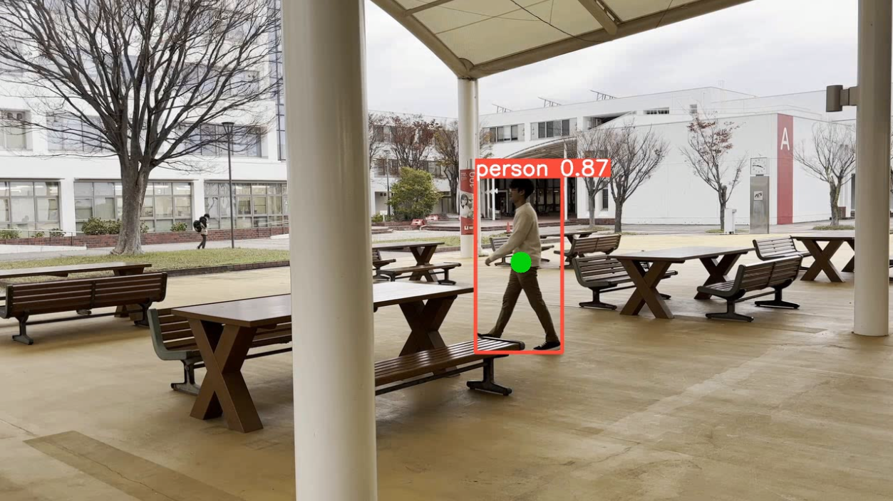

# Single Person Tracking with Occlusion using Kalman Filter


## Description

This project aims to create a system for tracking a single person using cameras, combining YOLOv8 for detection and a Kalman filter for enhanced tracking accuracy, especially during periods of poor visibility or detection failure.

## Getting Started

### Dependencies

* [Ultralytics](https://github.com/ultralytics/ultralytics)
* [Filterpy](https://github.com/rlabbe/filterpy)

### Installing

```
pip install ultralytics
pip install filterpy
```

### Executing program

Open the jupyter notebook: `Source Code-Assignment 2.ipynb`

### Result

